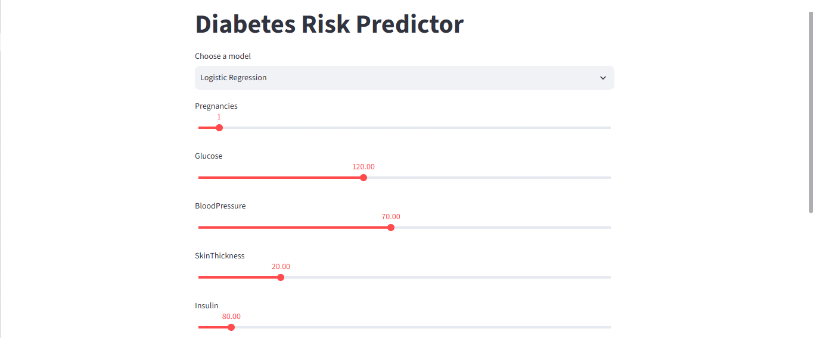

# Pima Indians Diabetes Classification

A machine learning project that predicts diabetes onset using the Pima Indians Diabetes dataset, comparing four classification models with hyperparameter tuning and deployed through a Streamlit app.




## Overview

This project builds and compares four classification models to predict diabetes risk from patient health indicators. The pipeline includes median imputation for missing values, and standardization, with each model tuned using Optuna to optimize F1 score (chosen due to class imbalance in the dataset). The final trained models are deployed through an interactive Streamlit app for interactive predictions.

## Models & Results

| Model               | F1 Score      | Notes        |
|---------------------|---------------|--------------|
| KNN                 | 0.709729      | Optuna-tuned | 
| Random Forest       | 0.703846      | Optuna-tuned |
| Logistic Regression | 0.694712      | Optuna-tuned |
| SVM                 | 0.661406      | Optuna-tuned |

## Features

- Full preprocessing pipeline: SimpleImputer and StandardScaler
- Stratified train/test split to preserve class balance
- Hyperparameter tuning via Optuna, optimized for F1 score
- Four trained models (Logistic Regression, KNN, Random Forest, SVM) saved together in a single pickle file
- an interactive Streamlit app for real-time predictions

## Tech Stack

Python · scikit-learn · Optuna · pandas · NumPy · Streamlit

## Project Structure

```
├── assets/
│   └── screenshot.png
├── data/
│   └── diabetes.csv
├── notebooks/
│   └── pima_diabetes.ipynb
├── src/
│   └── streamlit_app.py
├── models/
│   └── diabetes_model.pkl  
├── requirements.txt
├── README.md
└── LICENSE
```

## Installation

```
git clone https://github.com/laylasalama/pima-diabetes-ml-classifier-with-4-algorithms.git
cd pima-diabetes-ml-classifier-with-4-algorithms
pip install -r requirements.txt

```

## Usage

streamlit run src/streamlit_app.py

## Contributors

- [Layla Salama](https://github.com/laylasalama)
- [Layla Bendary](https://github.com/yf76twk7vp-rgb)
- [Malak ElGohary](https://github.com/malakelgohari22)
- [Shahd Mohamed](https://github.com/shado0w-allam)
- [Doaa Fathy](https://github.com/doaa715)

## License

This project is licensed under the MIT License — see the [LICENSE](LICENSE) file for details.
